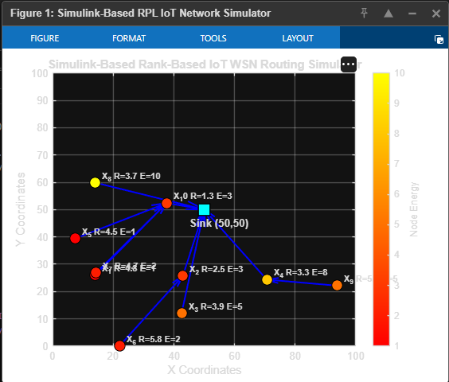

# Simulink-Based RPL-Inspired IoT Wireless Sensor Network Routing Simulator

This project is a MATLAB and Simulink-based simulator for demonstrating simplified RPL-inspired routing in an IoT Wireless Sensor Network.

The simulator deploys sensor nodes randomly in a 100 x 100 area, places a sink node at the center, calculates communication links using Euclidean distance, computes rank values using distance-based link cost, and selects parent nodes for forwarding data toward the sink.

This project is designed for IoT / Simulink coursework and focuses on understanding basic rank-based routing and DODAG-like parent selection.

> **Note:** The Simulink model file (`RPL_IoT_Network_Simulator.slx`) is not included in this repository because it was built in MATLAB Online / Simulink Online. Follow [simulink/SIMULINK_MODEL_SETUP.md](simulink/SIMULINK_MODEL_SETUP.md) to recreate the model manually.

## Project Topic

**Simulink-Based RPL-Inspired IoT Wireless Sensor Network Routing Simulator**

## Overview

Wireless Sensor Networks are commonly used in IoT systems where small sensor nodes collect data and forward it toward a central sink or gateway.

RPL is a routing protocol designed for low-power and lossy networks. In RPL, nodes form a routing structure toward a root node using rank values. This project does not implement the complete RPL protocol, but it simulates the core idea of rank-based parent selection.

Each node selects the parent that gives the lowest rank path toward the sink.

## Features

- Simulates an IoT Wireless Sensor Network
- Uses 10 randomly deployed sensor nodes
- Places sink node at `(50, 50)`
- Uses a 100 x 100 simulation area
- Assigns random energy values to sensor nodes
- Calculates Euclidean distance between nodes
- Checks communication range
- Calculates distance-based link cost
- Computes rank for each node
- Selects parent node based on lowest rank
- Supports multi-hop routing paths
- Provides MATLAB plotting
- Includes Simulink MATLAB Function block code
- Includes documentation for manual Simulink model creation

## Simulation Parameters

| Parameter | Value |
|---|---:|
| Area Width | 100 |
| Area Height | 100 |
| Sensor Nodes | 10 |
| Sink Nodes | 1 |
| Total Nodes | 11 |
| Sink Position | `(50, 50)` |
| Communication Range | 40 |
| Sink Energy | 100 |
| Sensor Node Energy | Random 1 to 10 |

## Routing Logic

The simulator calculates distance between nodes using:

```text
d = sqrt((x2 - x1)^2 + (y2 - y1)^2)
```

A link exists only if:

```text
distance <= communication_range
```

Link cost is calculated as:

```text
link_cost = distance * 0.1
```

Rank is calculated as:

```text
Node Rank = Parent Rank + Link Cost
```

The sink node has rank:

```text
0
```

Each sensor node selects the neighbor that gives the lowest rank path toward the sink.

## Example Routing Path

Example:

```text
X_9 -> X_4 -> Sink
```

This means node `X_9` forwards its data to node `X_4`, and node `X_4` forwards it to the sink.

## Repository Structure

```text
simulink-IoT-Project/
├── README.md
├── src/
│   ├── rpl_routing_core.m
│   ├── run_matlab_simulation.m
│   ├── plot_rpl_network.m
│   ├── plot_simulink_results.m
│   └── simulink_function_block_code.m
├── simulink/
│   ├── SIMULINK_MODEL_SETUP.md
│   ├── block_diagram_description.md
│   └── expected_model_layout.txt
├── docs/
│   ├── project_scope.md
│   ├── output_explanation.md
│   ├── simulation_workflow.md
│   └── limitations.md
└── screenshots/
    └── README.md
```

## Running Without Simulink

You can run the MATLAB script version directly.

Open MATLAB or MATLAB Online, go to the `src` folder, and run:

```matlab
run('run_matlab_simulation.m')
```

This will:

1. Generate random sensor nodes
2. Calculate routing ranks
3. Select parent nodes
4. Print the routing table
5. Plot the network topology

## Running With Simulink

Create a Simulink model named:

```text
RPL_IoT_Network_Simulator.slx
```

The model should contain:

* 3 Constant blocks
* 1 MATLAB Function block
* 5 To Workspace blocks

See [simulink/SIMULINK_MODEL_SETUP.md](simulink/SIMULINK_MODEL_SETUP.md) for step-by-step instructions.

### Constant Blocks

| Block  | Value |
| ------ | ----: |
| width  |   100 |
| height |   100 |
| range  |    40 |

### MATLAB Function Block

Paste the code from:

```text
src/simulink_function_block_code.m
```

into the MATLAB Function block.

### To Workspace Blocks

Use these output variable names:

| Output      | Workspace Variable |
| ----------- | ------------------ |
| X           | X                  |
| Y           | Y                  |
| node_energy | Energy             |
| node_rank   | Rank               |
| parent_node | parent_node        |

After running the Simulink model, MATLAB stores the result inside:

```matlab
out
```

Expected fields:

```text
out.Energy
out.Rank
out.X
out.Y
out.parent_node
```

To plot Simulink output, run:

```matlab
plot_simulink_results
```

## Tested Simulink Output Format

In MATLAB Online, the output appeared as:

```text
out =

Simulink.SimulationOutput:

Energy       [11x51 double]
Rank         [11x51 double]
X            [11x51 double]
Y            [11x51 double]
parent_node  [11x51 double]
tout         [51x1 double]
```

The final simulation values are extracted using:

```matlab
X = out.X(:, end);
Y = out.Y(:, end);
node_energy = out.Energy(:, end);
node_rank = out.Rank(:, end);
parent_node = out.parent_node(:, end);
```

## Output Graph

The graph shows:

* Sink node as a square
* Sensor nodes as circular markers
* Energy level using color
* Arrows from each node to its parent
* Rank and energy label for each node

Example node label:

```text
X_4 R=3.3 E=8
```

Meaning:

* Node: `X_4`
* Rank: `3.3`
* Energy: `8`

## Output Table

The command window prints:

```text
Node ID    X Pos    Y Pos    Energy    Rank    Parent
```

Example:

```text
X_9        93.9     22.1     5         5.63    X_4
```

This means `X_9` forwards data to `X_4`.

## Screenshots

### Simulation Output Graph



### Simulink MATLAB Function Block


## Project Scope

This project demonstrates a simplified RPL-inspired rank-based routing mechanism for IoT Wireless Sensor Networks.

It is suitable for understanding:

* Node deployment
* Sink-based routing
* Link cost
* Rank calculation
* Parent selection
* Multi-hop path formation

See [docs/project_scope.md](docs/project_scope.md) for full scope details.

## Limitations

This is not a full RPL implementation.

It does not include:

* DIO messages
* DAO messages
* DIS messages
* Trickle timer
* IPv6
* 6LoWPAN
* Packet loss
* Latency
* Throughput
* Real packet forwarding
* Real sensor hardware
* Energy depletion over time
* Mobility
* Security attacks

See [docs/limitations.md](docs/limitations.md) for the complete list.

## Future Improvements

Possible improvements:

* Add energy consumption during transmission
* Add packet forwarding simulation
* Add node death when energy reaches zero
* Add packet delivery ratio
* Add delay calculation
* Add mobility
* Add RPL control message simulation
* Add DODAG visualization
* Add attack detection such as rank attack or sinkhole attack

## Correct Description

This project should be described as:

```text
A Simulink-based RPL-inspired rank-based routing simulator for IoT Wireless Sensor Networks.
```

Avoid calling it a complete RPL protocol implementation.

## Suggested Final Topic Name

```text
Simulink-Based RPL-Inspired IoT Wireless Sensor Network Routing Simulator
```

Alternative:

```text
Simulink-Based Rank-Based Routing Simulator for IoT Wireless Sensor Networks
```

## Documentation

| Document | Description |
|----------|-------------|
| [Project Scope](docs/project_scope.md) | Goals, features, and what is excluded |
| [Simulation Workflow](docs/simulation_workflow.md) | Step-by-step simulation process |
| [Output Explanation](docs/output_explanation.md) | Meaning of each output variable |
| [Limitations](docs/limitations.md) | Known simplifications and missing features |
| [Simulink Setup](simulink/SIMULINK_MODEL_SETUP.md) | How to build the `.slx` model manually |
| [Block Diagram](simulink/block_diagram_description.md) | Simulink block-level description |

## License

This project is licensed under the [MIT License](LICENSE).

## Author

**Muhammad Abdur Rafay Qureshi**

IoT / Simulink coursework — RPL-inspired rank-based routing simulator for Wireless Sensor Networks.
