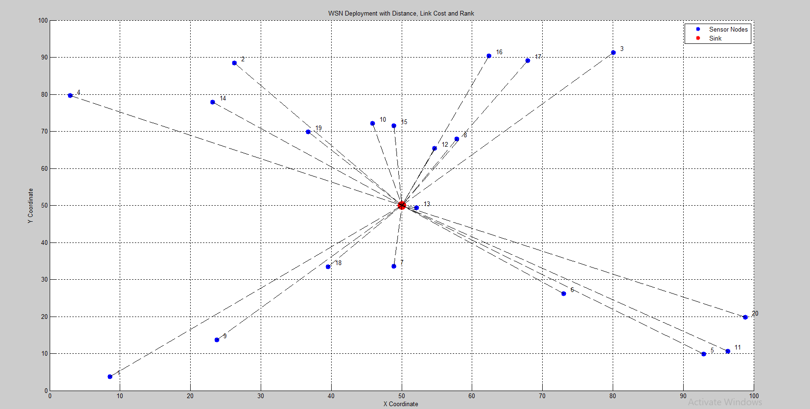
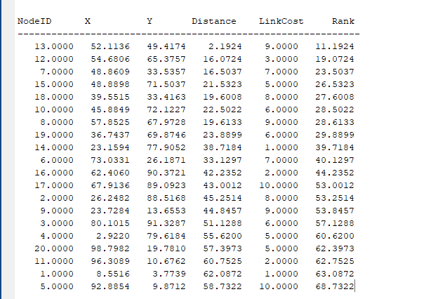
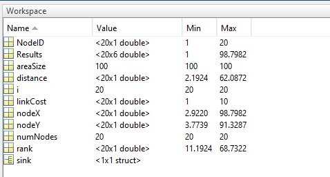

# Wireless Sensor Network (WSN) Deployment & Node Ranking

A MATLAB simulation of an IoT **Wireless Sensor Network** where sensor nodes are randomly deployed in a 2D area, evaluated by distance and link cost, and ranked for optimal routing toward a central sink node.

---

## Screenshots

### Network Topology

Star layout with 20 sensor nodes (blue) and central sink (red) at `(50, 50)`.



### Node Ranking Table

Console output with nodes sorted by rank (`Distance + LinkCost`).



### MATLAB Workspace

Variables in memory after running `wsn_deployment_ranking.m`.




---

## Overview

This project models a fundamental IoT networking scenario: **many distributed sensor nodes** collecting data and forwarding it to a **single sink (gateway)**. Each node is scored using a composite **rank** metric that combines:

- **Distance** — Euclidean distance from the node to the sink (physical proximity)
- **Link Cost** — Simulated communication cost (energy, latency, or channel quality)

Nodes with a **lower rank** are preferred for routing and data collection because they are closer to the sink and/or have cheaper links.

This is a simplified analogue of rank-based routing concepts used in protocols such as **RPL** (IPv6 Routing Protocol for Low-Power and Lossy Networks), commonly found in IoT deployments.

---

## Features


| Feature           | Description                                            |
| ----------------- | ------------------------------------------------------ |
| Random deployment | 20 sensor nodes placed uniformly in a 100×100 area     |
| Central sink      | Gateway fixed at the geometric center `(50, 50)`       |
| Distance metric   | Euclidean distance from each node to the sink          |
| Link cost         | Random integer cost between 1 and 10 per node          |
| Node ranking      | `Rank = Distance + LinkCost`, sorted ascending         |
| Visualization     | Star-topology plot with labeled nodes and dashed links |
| Console output    | Tabular results matrix printed to the Command Window   |


---

## Project Structure

```
simulink-IoT Project/
├── wsn_deployment_ranking.m   # Main simulation script
├── screenshots/
│   ├── network_topology.png   # WSN deployment visualization
│   ├── node_ranking_table.png # Sorted node metrics (console output)
│   └── matlab_workspace.png   # MATLAB workspace variables after run
├── README.md
├── LICENSE
└── .gitignore
```

---

## Requirements

- **MATLAB** R2016b or later (uses standard built-in functions only)
- No additional toolboxes required

---

## Getting Started

### 1. Clone the repository

```bash
git clone https://github.com/<your-username>/simulink-IoT-Project.git
cd simulink-IoT-Project
```

### 2. Run the simulation

Open MATLAB, navigate to the project folder, and run:

```matlab
wsn_deployment_ranking
```

Or from the MATLAB Command Window:

```matlab
run('wsn_deployment_ranking.m')
```

### 3. Expected output

- A **figure window** showing the network topology (blue nodes, red sink, dashed links)
- A **table in the Command Window** listing all nodes sorted by rank (best first)

---

## How It Works

### Step 1 — Network Parameters

```matlab
numNodes = 20;      % 20 sensor nodes
areaSize = 100;     % 100×100 deployment region
```

The sink is placed at the center of the deployment area:

```matlab
sink.x = areaSize/2;   % 50
sink.y = areaSize/2;   % 50
```

### Step 2 — Random Node Deployment

Each sensor node receives random `(X, Y)` coordinates within `[0, 100]`:

```matlab
nodeX = rand(numNodes, 1) * areaSize;
nodeY = rand(numNodes, 1) * areaSize;
```

This mimics ad-hoc IoT sensor placement in an open field or indoor environment.

### Step 3 — Distance Calculation

Euclidean distance from each node to the sink:

$$
d_i = \sqrt{(x_i - x_{sink})^2 + (y_i - y_{sink})^2}
$$

```matlab
distance = sqrt((nodeX - sink.x).^2 + (nodeY - sink.y).^2);
```

### Step 4 — Link Cost Assignment

Each node is assigned a random link cost between 1 and 10, simulating varying channel conditions (interference, packet loss, energy drain):

```matlab
linkCost = randi([1 10], numNodes, 1);
```

### Step 5 — Rank Computation

The rank combines physical distance and communication cost:

$$
\text{Rank}_i = \text{Distance}_i + \text{LinkCost}_i
$$

```matlab
rank = distance + linkCost;
```

**Lower rank = better node** for direct communication with the sink.

### Step 6 — Results Table

All metrics are assembled into a matrix and sorted by rank:


| Column   | Description                         |
| -------- | ----------------------------------- |
| NodeID   | Unique node identifier (1–20)       |
| X        | X-coordinate in the deployment area |
| Y        | Y-coordinate in the deployment area |
| Distance | Euclidean distance to sink          |
| LinkCost | Simulated link communication cost   |
| Rank     | Combined routing priority score     |


```matlab
Results = [NodeID nodeX nodeY distance linkCost rank];
Results = sortrows(Results, 6);   % Sort by Rank (column 6)
```

### Step 7 — Network Visualization

The script plots a **star topology** where every sensor node connects directly to the sink (single-hop communication). This is typical for small WSNs or the initial discovery phase before multi-hop routing is established.

---

## Output Details

### Network Topology

The figure shows 20 blue sensor nodes (labeled 1–20), the red sink at `(50, 50)`, and dashed black lines representing direct links to the gateway.


### Node Ranking Table

Console output after sorting by rank. Node **13** has the lowest rank (~11.19) because it sits very close to the sink with a moderate link cost. Node **5** has the highest rank (~68.73) due to being far from the sink.


**Example (top-ranked node):**


| NodeID | X     | Y     | Distance | LinkCost | Rank      |
| ------ | ----- | ----- | -------- | -------- | --------- |
| 13     | 52.11 | 49.42 | 2.19     | 9.00     | **11.19** |


**Example (lowest-ranked node):**


| NodeID | X     | Y    | Distance | LinkCost | Rank      |
| ------ | ----- | ---- | -------- | -------- | --------- |
| 5      | 92.89 | 9.87 | 58.73    | 10.00    | **68.73** |


### MATLAB Workspace

After execution, the following variables are available in the workspace:


| Variable         | Size   | Description                     |
| ---------------- | ------ | ------------------------------- |
| `numNodes`       | 1×1    | Number of sensor nodes (20)     |
| `areaSize`       | 1×1    | Deployment area dimension (100) |
| `nodeX`, `nodeY` | 20×1   | Node coordinates                |
| `sink`           | struct | Sink position (`x`, `y`)        |
| `distance`       | 20×1   | Per-node distance to sink       |
| `linkCost`       | 20×1   | Per-node link cost (1–10)       |
| `rank`           | 20×1   | Per-node rank score             |
| `Results`        | 20×6   | Full sorted results matrix      |
| `NodeID`         | 20×1   | Node identifiers                |


---

## Network Topology Diagram

```
                    [Node 3]
                        |
    [Node 4]            |            [Node 8]
         \              |              /
          \             |             /
           \    [Node 13]            /
            \       |              /
             \      |             /
              \  [SINK]          /
               \  (50,50)       /
                \    |        /
                 \   |       /
                  \  |      /
            [Node 1] | [Node 20]
```

All nodes communicate in a **single-hop star topology** directly with the central sink — a common pattern in small-scale IoT gateways (e.g., Zigbee coordinator, LoRaWAN gateway, Wi-Fi AP).

---

## IoT Context & Real-World Relevance


| Simulation Concept | Real-World IoT Equivalent                            |
| ------------------ | ---------------------------------------------------- |
| Sensor nodes       | Temperature, motion, or humidity sensors             |
| Sink / Gateway     | Edge gateway, MQTT broker, cloud ingress             |
| Distance           | RF path loss, geographic proximity                   |
| Link Cost          | Battery drain, retransmissions, SNR                  |
| Rank               | Routing priority in mesh/LLN protocols (RPL, Zigbee) |


In production IoT systems, rank-based routing helps determine which nodes should act as **preferred parents** when building multi-hop paths toward a border router or cloud endpoint.

---

## Customization

You can tune the simulation by editing parameters at the top of `wsn_deployment_ranking.m`:

```matlab
numNodes = 20;          % Increase for denser networks
areaSize = 100;         % Change deployment area size
linkCost = randi([1 10], numNodes, 1);  % Adjust cost range
```

**Ideas for extension:**

- Weight distance and link cost differently: `rank = 0.7*distance + 0.3*linkCost`
- Add multi-hop routing instead of star topology
- Simulate node energy depletion over time
- Export results to CSV for analysis
- Integrate with Simulink for hardware-in-the-loop testing

---

## License

This project is licensed under the [MIT License](LICENSE) — Copyright (c) 2026 AbdurRafay Qureshi.

---

## Author

**AbdurRafay Qureshi(2023F-BCE-006)**

**Nauman Imtiaz(2023F-BCE-008)**

**Maaz Sohail(2023F-BCE-029)**

IoT / Simulink coursework project — Wireless Sensor Network deployment and node ranking simulation.